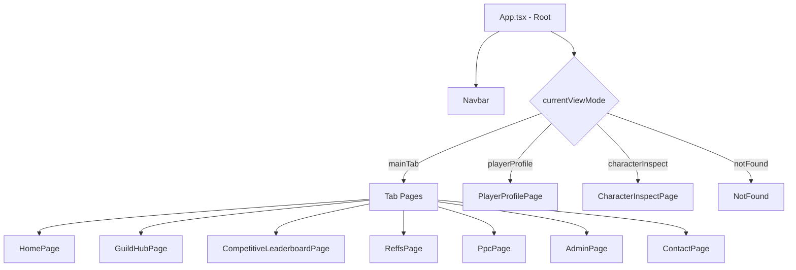

# Architecture — Karuhun Web

This document explains the architectural decisions, data flow, and technical details of Karuhun Web.

---

## Overview

Karuhun Web is a **Single Page Application (SPA)** built with React. Navigation between pages is state-driven rather than URL-driven — all routing is controlled through `activeTab` and `currentViewMode` state in `App.tsx`.



---

## Data Flow

### 1. Guild Data (Real-time from Huaxu API)

```
Huaxu API
    → fetch via apiService.ts (4s timeout, 3-minute in-memory cache)
    → App.tsx state: currentGuild, members, loadingGuild
    → props passed down to:
        GuildHubPage → GuildMembersRoster
        PlayerProfilePage → CharacterInspectPage
```

**Fallback strategy:** If the Huaxu API times out or returns an error, data is read from the JSON fallback files in `src/data/fallbacks/`. This keeps the site functional even when the API is down.

### 2. Static Data

Data that changes infrequently and does not need to be real-time is managed as static TypeScript or JSON files:

| File | Contents |
|---|---|
| `src/data/static/ppcScores.ts` | PPC boss score database |
| `src/data/static/reffsData.ts` | Strategy reference content |
| `src/data/static/contactData.ts` | Contact and recruitment info |
| `src/data/static/siegeBranchData.ts` | Siege data per guild branch |
| `src/data/static/telemetryData.ts` | Alliance telemetry data |

### 3. Supabase Data

Supabase is used for two things:

1. **Admin authentication** — `supabase.auth.signInWithPassword()` in `AdminPage.tsx`
2. **Guild snapshot storage** — via `recapService.ts` for periodic recap data

---

## Routing

This project does **not use React Router**. Routing is implemented manually via state in `App.tsx`:

```ts
const [activeTab, setActiveTab] = useState<MainTab>('home');
const [currentViewMode, setCurrentViewMode] = useState<
  'mainTab' | 'playerProfile' | 'characterInspect' | 'notFound'
>('mainTab');
```

### URL Sync

The `syncRouteFromLocation()` function in `App.tsx` parses `window.location.pathname` on first load and supports the following URL patterns:

| URL Pattern | Page rendered |
|---|---|
| `/` | Home |
| `/hub` | Guild Hub |
| `/reffs` | Strategy References |
| `/leaderboards` | Competitive Leaderboard |
| `/ppc` | PPC Tools |
| `/admin` | Admin Panel |
| `/contact` | Contact |
| `/player/:server/:uid` | Player Profile |
| `/player/:server/:uid/character/:charId` | Character Inspect |

Legacy hash-based URLs (e.g. `/#/player/ap/12345`) are also supported for backward compatibility.

---

## Component Architecture

### Hierarchy

```
App.tsx                         ← Root: global state + routing
├── GuildIntroOverlay           ← Fullscreen intro (session-based, shown once)
├── Navbar                      ← Main tab navigation
├── [Page Content]              ← One of pages/ based on current state
│   ├── [Section Components]   ← from components/home/, components/guild/, etc.
│   │   └── [UI Primitives]    ← from components/ui/
└── Footer
```

### Common Components (Reusable)

| Component | Purpose |
|---|---|
| `Navbar.tsx` | Main tab navigation with mobile menu |
| `Footer.tsx` | Footer with guild info and social links |
| `ScrollReveal.tsx` | Scroll-triggered animation wrapper (spring physics) |
| `MarkdownRenderer.tsx` | Renders Markdown content (used in ReffsPage) |
| `BackButton.tsx` | Standardized back navigation button |
| `GuildBranchCard.tsx` | Guild division selector card |

---

## Performance

### In-Memory API Cache

`apiService.ts` implements a simple `Map`-based cache with a 3-minute TTL:

```ts
const apiCache = new Map<string, { data: any; timestamp: number }>();
const CACHE_TTL_MS = 3 * 60 * 1000;
```

This prevents redundant network calls and reduces the chance of hitting rate limits during a single session.

### Fetch Timeout

Every request to the Huaxu API has a 4-second timeout enforced via `AbortController`. On timeout, the app immediately falls back to local JSON data.

### Asset Strategy

- **Large static assets** (logo, intro video) go in `public/` and are served directly without going through the Vite bundler.
- **Assets that need processing** (contributor images imported in code) go in `src/assets/`.
- Icons from `lucide-react` are tree-shaken by Rollup at build time — only imported icons appear in the bundle.

---

## Security

### API Key

`VITE_HUAXU_API_KEY` is read from an environment variable and never hardcoded in source code. Because it carries the `VITE_` prefix, it is inlined into the client-side JavaScript bundle and is visible to anyone with browser DevTools. This is a known trade-off given that the Huaxu API does not support server-side proxying via CORS. Rotate the key periodically.

### Admin Authentication

Admin authentication uses **Supabase Auth** (`signInWithPassword`) rather than a static passcode. Session tokens are managed automatically by the Supabase client.

### Supabase RLS

Row Level Security policies are defined in `supabase/rls_policies.sql`. Every table containing sensitive data should have RLS enabled.

---

## Deployment (Vercel)

`vercel.json` uses a catch-all rewrite for SPA routing:

```json
{
  "rewrites": [{ "source": "/(.*)", "destination": "/index.html" }]
}
```

All URL requests (except static files) are redirected to `index.html`, and client-side JavaScript handles the routing from there.

---

## Database (Supabase)

### Main Tables

| Table | Purpose |
|---|---|
| `guild_snapshots` | Periodic snapshots of guild member data |
| `auth.users` | Admin users (managed by Supabase Auth) |

See `supabase/rls_policies.sql` for the full access policy definitions.

---

## Dependency Decisions

| Package | Reason |
|---|---|
| `@radix-ui/react-avatar` | Accessible, headless avatar primitive |
| `@radix-ui/react-slot` | Component composition via the `asChild` pattern |
| `class-variance-authority` | Type-safe variant management for UI components |
| `lucide-react` | Consistent icon set with full tree-shaking support |
| `@supabase/supabase-js` | Official Supabase client for auth and database access |
